Code
================
Group 6

\#import code

``` r
library(tidyverse)
```

    ## ── Attaching packages ─────────────────────────────────────── tidyverse 1.3.0 ──

    ## ✓ ggplot2 3.3.2     ✓ purrr   0.3.4
    ## ✓ tibble  3.0.4     ✓ dplyr   1.0.2
    ## ✓ tidyr   1.1.2     ✓ stringr 1.4.0
    ## ✓ readr   1.4.0     ✓ forcats 0.5.0

    ## ── Conflicts ────────────────────────────────────────── tidyverse_conflicts() ──
    ## x dplyr::filter() masks stats::filter()
    ## x dplyr::lag()    masks stats::lag()

``` r
EugeneHomes <- read_csv("data/EugeneHomes.csv")
```

    ## 
    ## ── Column specification ────────────────────────────────────────────────────────
    ## cols(
    ##   id = col_double(),
    ##   price = col_double(),
    ##   size = col_double(),
    ##   lot = col_double(),
    ##   bath = col_double(),
    ##   bed = col_double(),
    ##   bathbed = col_double(),
    ##   year = col_double(),
    ##   age = col_double(),
    ##   agesq = col_double(),
    ##   garage = col_double(),
    ##   status = col_double(),
    ##   active = col_double(),
    ##   elem = col_character(),
    ##   edison = col_double(),
    ##   harris = col_double(),
    ##   adams = col_double(),
    ##   crest = col_double(),
    ##   parker = col_double()
    ## )

\#means and summary statistics by group

``` r
library(Rmisc)
```

    ## Loading required package: lattice

    ## Loading required package: plyr

    ## ------------------------------------------------------------------------------

    ## You have loaded plyr after dplyr - this is likely to cause problems.
    ## If you need functions from both plyr and dplyr, please load plyr first, then dplyr:
    ## library(plyr); library(dplyr)

    ## ------------------------------------------------------------------------------

    ## 
    ## Attaching package: 'plyr'

    ## The following objects are masked from 'package:dplyr':
    ## 
    ##     arrange, count, desc, failwith, id, mutate, rename, summarise,
    ##     summarize

    ## The following object is masked from 'package:purrr':
    ## 
    ##     compact

``` r
sum = summarySE(EugeneHomes,
                measurevar="price",groupvars=c("status","garage"))
```

    ## Warning in qt(conf.interval/2 + 0.5, datac$N - 1): NaNs produced

``` r
sum
```

    ##   status garage  N    price       sd        se        ci
    ## 1      1      0  1 259.9000       NA        NA        NA
    ## 2      1      1  3 283.1333 58.79969 33.948016 146.06652
    ## 3      1      2 21 306.1357 34.58405  7.546858  15.74247
    ## 4      2      1  2 261.7500 88.74190 62.750000 797.31435
    ## 5      2      2  9 309.9778 53.03715 17.679051  40.76796
    ## 6      2      3  2 319.4500 28.92067 20.450000 259.84189
    ## 7      3      0 10 245.5500 59.36490 18.772831  42.46709
    ## 8      3      1  8 251.8625 73.34922 25.932866  61.32148
    ## 9      3      2 20 287.9850 71.81989 16.059415  33.61274

\#interaction plot using summary statistics

``` r
library(ggplot2)
pd = position_dodge(.2)
ggplot(sum, aes(x=status,
                y=price,
                color=garage)) +
  
  geom_errorbar(aes(ymin=price-se,
                    ymax=price+se),
                width=.2, size=0.7, position=pd) +
  geom_point(shape=15, size=4, position=pd) +
  theme_bw() +
  theme(
    axis.title.y = element_text(vjust= 1.8),
    axis.title.x = element_text(vjust= -0.5),
    axis.title = element_text(face = "bold"))
```

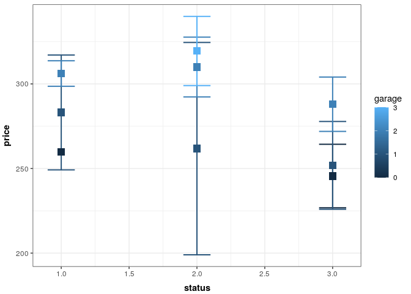<!-- -->

\#boxplot of each predictor and interaction

``` r
boxplot(price ~ status,
        data = EugeneHomes,
        xlab = "Status of Homes",
        ylab = "Price of Homes in Thousands")
```

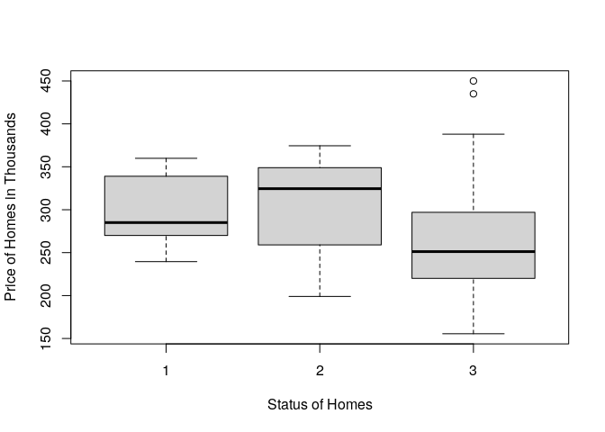<!-- -->

``` r
boxplot(price ~ garage,
        data = EugeneHomes,
        xlab = "Number of Garages in Homes",
        ylab = "Price of Homes in Thousands")
```

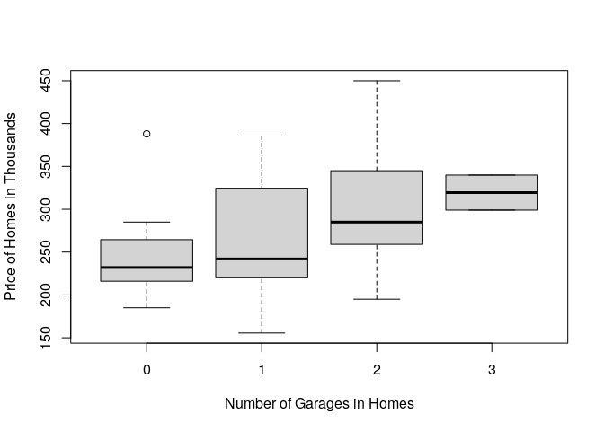<!-- -->

``` r
boxplot(price ~ status:garage,
        data = EugeneHomes,
        xlab = "Status x Garage",
        ylab = "Price of Homes")
```

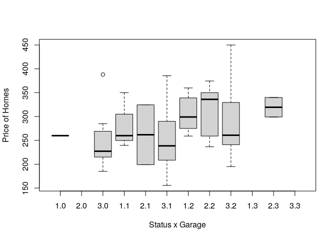<!-- -->

\#Fitting Model and Conducting ANOVA (lm is type 2)

``` r
model = lm(price ~ status + garage + status:garage,
             data = EugeneHomes)
anova(model)
```

    ## Analysis of Variance Table
    ## 
    ## Response: price
    ##               Df Sum Sq Mean Sq F value   Pr(>F)   
    ## status         1  17232 17232.5  5.3348 0.023775 * 
    ## garage         1  23172 23171.9  7.1735 0.009161 **
    ## status:garage  1     22    21.8  0.0067 0.934777   
    ## Residuals     72 232576  3230.2                    
    ## ---
    ## Signif. codes:  0 '***' 0.001 '**' 0.01 '*' 0.05 '.' 0.1 ' ' 1

``` r
summary(model)
```

    ## 
    ## Call:
    ## lm(formula = price ~ status + garage + status:garage, data = EugeneHomes)
    ## 
    ## Residuals:
    ##     Min      1Q  Median      3Q     Max 
    ## -108.50  -38.27  -17.93   38.83  162.28 
    ## 
    ## Coefficients:
    ##               Estimate Std. Error t value Pr(>|t|)    
    ## (Intercept)    264.975     61.598   4.302 5.25e-05 ***
    ## status          -8.231     22.214  -0.371    0.712    
    ## garage          26.765     33.040   0.810    0.421    
    ## status:garage   -1.015     12.359  -0.082    0.935    
    ## ---
    ## Signif. codes:  0 '***' 0.001 '**' 0.01 '*' 0.05 '.' 0.1 ' ' 1
    ## 
    ## Residual standard error: 56.84 on 72 degrees of freedom
    ## Multiple R-squared:  0.1481, Adjusted R-squared:  0.1126 
    ## F-statistic: 4.172 on 3 and 72 DF,  p-value: 0.008815

\#Checking Assumptions

``` r
hist(residuals(model))
```

<!-- -->

``` r
plot(fitted(model),
     residuals(model))
```

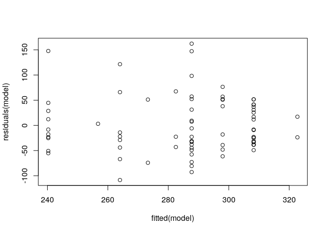<!-- -->

\#multiple comparisons Bonferroni?

\#Corilation \#First, create a subset without variables to right of
status

``` r
library(dplyr)

EugeneHomes = select(EugeneHomes,
                     price,
                        size,
                        lot,
                        bath,
                        bed,
                        bathbed,
                        year,
                        age,
                        agesq,
                        garage,
                        status)
```

\#to view new subset dataset with the terms specified

``` r
library(FSA)
```

    ## ## FSA v0.8.31. See citation('FSA') if used in publication.
    ## ## Run fishR() for related website and fishR('IFAR') for related book.

``` r
headtail(EugeneHomes)
```

    ##    price  size lot bath bed bathbed year  age agesq garage status
    ## 1  388.0 2.180   4    3   4      12 1940 -3.0  9.00      0      3
    ## 2  450.0 2.054   5    3   4      12 1957 -1.3  1.69      2      3
    ## 3  386.0 2.112   5    2   4       8 1955 -1.5  2.25      2      3
    ## 74 435.0 2.253  11    2   3       6 1979  0.9  0.81      2      3
    ## 75 274.9 1.861   4    2   4       8 1995  2.5  6.25      2      1
    ## 76 349.5 2.896   4    3   5      15 1979  0.9  0.81      2      1

\#to view corrilation

``` r
library(psych)
```

    ## 
    ## Attaching package: 'psych'

    ## The following object is masked from 'package:FSA':
    ## 
    ##     headtail

    ## The following objects are masked from 'package:ggplot2':
    ## 
    ##     %+%, alpha

``` r
corr.test(EugeneHomes,
          use = "pairwise", 
          method = "pearson", 
          adjust = "none")
```

    ## Call:corr.test(x = EugeneHomes, use = "pairwise", method = "pearson", 
    ##     adjust = "none")
    ## Correlation matrix 
    ##         price size   lot  bath   bed bathbed  year   age agesq garage status
    ## price    1.00 0.20  0.24  0.17 -0.29   -0.01  0.15  0.15  0.28   0.36  -0.25
    ## size     0.20 1.00  0.04  0.47  0.24    0.47  0.18  0.18  0.01   0.17   0.12
    ## lot      0.24 0.04  1.00 -0.17 -0.21   -0.22 -0.04 -0.04 -0.18   0.24  -0.05
    ## bath     0.17 0.47 -0.17  1.00  0.15    0.79  0.33  0.33 -0.02   0.20  -0.05
    ## bed     -0.29 0.24 -0.21  0.15  1.00    0.71 -0.36 -0.36  0.05  -0.40   0.20
    ## bathbed -0.01 0.47 -0.22  0.79  0.71    1.00 -0.01 -0.01  0.01  -0.11   0.09
    ## year     0.15 0.18 -0.04  0.33 -0.36   -0.01  1.00  1.00 -0.35   0.54  -0.30
    ## age      0.15 0.18 -0.04  0.33 -0.36   -0.01  1.00  1.00 -0.35   0.54  -0.30
    ## agesq    0.28 0.01 -0.18 -0.02  0.05    0.01 -0.35 -0.35  1.00  -0.20   0.15
    ## garage   0.36 0.17  0.24  0.20 -0.40   -0.11  0.54  0.54 -0.20   1.00  -0.33
    ## status  -0.25 0.12 -0.05 -0.05  0.20    0.09 -0.30 -0.30  0.15  -0.33   1.00
    ## Sample Size 
    ## [1] 76
    ## Probability values (Entries above the diagonal are adjusted for multiple tests.) 
    ##         price size  lot bath  bed bathbed year  age agesq garage status
    ## price    0.00 0.08 0.03 0.13 0.01    0.92 0.18 0.18  0.02   0.00   0.03
    ## size     0.08 0.00 0.73 0.00 0.04    0.00 0.13 0.13  0.93   0.13   0.30
    ## lot      0.03 0.73 0.00 0.14 0.06    0.06 0.74 0.74  0.12   0.04   0.65
    ## bath     0.13 0.00 0.14 0.00 0.21    0.00 0.00 0.00  0.86   0.08   0.69
    ## bed      0.01 0.04 0.06 0.21 0.00    0.00 0.00 0.00  0.69   0.00   0.08
    ## bathbed  0.92 0.00 0.06 0.00 0.00    0.00 0.95 0.95  0.94   0.36   0.46
    ## year     0.18 0.13 0.74 0.00 0.00    0.95 0.00 0.00  0.00   0.00   0.01
    ## age      0.18 0.13 0.74 0.00 0.00    0.95 0.00 0.00  0.00   0.00   0.01
    ## agesq    0.02 0.93 0.12 0.86 0.69    0.94 0.00 0.00  0.00   0.08   0.21
    ## garage   0.00 0.13 0.04 0.08 0.00    0.36 0.00 0.00  0.08   0.00   0.00
    ## status   0.03 0.30 0.65 0.69 0.08    0.46 0.01 0.01  0.21   0.00   0.00
    ## 
    ##  To see confidence intervals of the correlations, print with the short=FALSE option

\#to view scatterplot matrix of all variables against each other

``` r
pairs(data=EugeneHomes, ~ price + size + lot + bath + bed + bathbed 
      + year + age + agesq + garage + status)
```

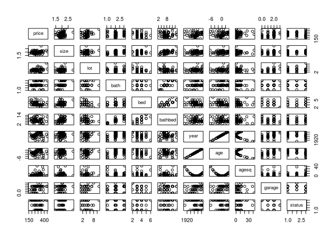<!-- -->

\#to view correlation with histograms, scatterplots and corrilation
\#numbers

``` r
library(PerformanceAnalytics)
```

    ## Loading required package: xts

    ## Loading required package: zoo

    ## 
    ## Attaching package: 'zoo'

    ## The following objects are masked from 'package:base':
    ## 
    ##     as.Date, as.Date.numeric

    ## 
    ## Attaching package: 'xts'

    ## The following objects are masked from 'package:dplyr':
    ## 
    ##     first, last

    ## 
    ## Attaching package: 'PerformanceAnalytics'

    ## The following object is masked from 'package:graphics':
    ## 
    ##     legend

``` r
chart.Correlation(EugeneHomes,
                  method="pearson",
                  histogram=TRUE,
                  pch=16)
```

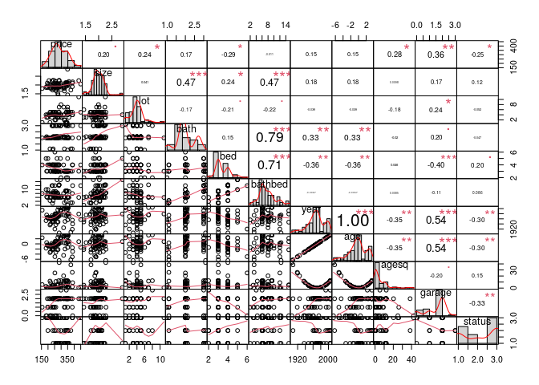<!-- -->

\#Stepwise procedure to determine the best regression equation

``` r
model.null = lm(price ~ 1, data=EugeneHomes)
model.full = lm(price ~ size + lot + bath + bed + bathbed 
                + year + age + agesq + garage + status, 
                data=EugeneHomes)

step(model.null,
     scope = list(upper=model.full),
     direction="both",
     data=EugeneHomes)
```

    ## Start:  AIC=624.17
    ## price ~ 1
    ## 
    ##           Df Sum of Sq    RSS    AIC
    ## + garage   1     35065 237938 615.73
    ## + bed      1     22361 250641 619.68
    ## + agesq    1     20763 252240 620.16
    ## + status   1     17232 255770 621.22
    ## + lot      1     16284 256718 621.50
    ## + size     1     11078 261925 623.03
    ## + bath     1      8328 264674 623.82
    ## <none>                 273002 624.17
    ## + year     1      6485 266517 624.35
    ## + age      1      6485 266517 624.35
    ## + bathbed  1        35 272967 626.16
    ## 
    ## Step:  AIC=615.73
    ## price ~ garage
    ## 
    ##           Df Sum of Sq    RSS    AIC
    ## + agesq    1     34615 203323 605.78
    ## + lot      1      7374 230563 615.33
    ## + bed      1      6529 231409 615.61
    ## <none>                 237938 615.73
    ## + size     1      5468 232470 615.96
    ## + status   1      5340 232598 616.00
    ## + bath     1      2981 234957 616.77
    ## + year     1       566 237372 617.55
    ## + age      1       566 237372 617.55
    ## + bathbed  1       201 237737 617.66
    ## - garage   1     35065 273002 624.17
    ## 
    ## Step:  AIC=605.78
    ## price ~ garage + agesq
    ## 
    ##           Df Sum of Sq    RSS    AIC
    ## + lot      1     12743 190580 602.86
    ## + status   1      7962 195362 604.74
    ## + bed      1      5384 197939 605.74
    ## <none>                 203323 605.78
    ## + size     1      4269 199054 606.17
    ## + bath     1      2562 200761 606.81
    ## + year     1       954 202369 607.42
    ## + age      1       954 202369 607.42
    ## + bathbed  1       279 203045 607.67
    ## - agesq    1     34615 237938 615.73
    ## - garage   1     48916 252240 620.16
    ## 
    ## Step:  AIC=602.86
    ## price ~ garage + agesq + lot
    ## 
    ##           Df Sum of Sq    RSS    AIC
    ## + status   1      8826 181753 601.26
    ## + bath     1      6169 184411 602.36
    ## <none>                 190580 602.86
    ## + size     1      4174 186406 603.18
    ## + year     1      3819 186761 603.32
    ## + age      1      3819 186761 603.32
    ## + bed      1      3375 187205 603.50
    ## + bathbed  1      1622 188958 604.21
    ## - lot      1     12743 203323 605.78
    ## - garage   1     37268 227848 614.43
    ## - agesq    1     39984 230563 615.33
    ## 
    ## Step:  AIC=601.26
    ## price ~ garage + agesq + lot + status
    ## 
    ##           Df Sum of Sq    RSS    AIC
    ## + size     1      7003 174751 600.27
    ## + bath     1      6635 175118 600.43
    ## <none>                 181753 601.26
    ## + year     1      2524 179229 602.19
    ## + age      1      2524 179229 602.19
    ## + bed      1      2468 179285 602.22
    ## + bathbed  1      2159 179595 602.35
    ## - status   1      8826 190580 602.86
    ## - lot      1     13608 195362 604.74
    ## - garage   1     23621 205374 608.54
    ## - agesq    1     43099 224852 615.43
    ## 
    ## Step:  AIC=600.27
    ## price ~ garage + agesq + lot + status + size
    ## 
    ##           Df Sum of Sq    RSS    AIC
    ## + bed      1      6891 167860 599.21
    ## <none>                 174751 600.27
    ## - size     1      7003 181753 601.26
    ## + bath     1      2278 172473 601.27
    ## + age      1      1437 173313 601.64
    ## + year     1      1437 173313 601.64
    ## + bathbed  1        17 174734 602.26
    ## - status   1     11656 186406 603.18
    ## - lot      1     13632 188383 603.98
    ## - garage   1     17150 191900 605.38
    ## - agesq    1     42002 216753 614.64
    ## 
    ## Step:  AIC=599.21
    ## price ~ garage + agesq + lot + status + size + bed
    ## 
    ##           Df Sum of Sq    RSS    AIC
    ## + bathbed  1      6711 161149 598.11
    ## <none>                 167860 599.21
    ## + bath     1      3027 164833 599.83
    ## - bed      1      6891 174751 600.27
    ## - garage   1      7247 175107 600.42
    ## + year     1       138 167722 601.15
    ## + age      1       138 167722 601.15
    ## - lot      1     10541 178401 601.84
    ## - status   1     11138 178998 602.09
    ## - size     1     11425 179285 602.22
    ## - agesq    1     38931 206791 613.06
    ## 
    ## Step:  AIC=598.11
    ## price ~ garage + agesq + lot + status + size + bed + bathbed
    ## 
    ##           Df Sum of Sq    RSS    AIC
    ## + bath     1      9767 151382 595.36
    ## - size     1      4047 165196 598.00
    ## <none>                 161149 598.11
    ## - garage   1      5138 166287 598.50
    ## - bathbed  1      6711 167860 599.21
    ## + year     1        30 161119 600.10
    ## + age      1        30 161119 600.10
    ## - status   1      9779 170928 600.59
    ## - lot      1     13419 174569 602.19
    ## - bed      1     13585 174734 602.26
    ## - agesq    1     39688 200837 612.84
    ## 
    ## Step:  AIC=595.36
    ## price ~ garage + agesq + lot + status + size + bed + bathbed + 
    ##     bath
    ## 
    ##           Df Sum of Sq    RSS    AIC
    ## <none>                 151382 595.36
    ## - size     1      5745 157127 596.19
    ## - garage   1      6987 158369 596.79
    ## - lot      1      7009 158391 596.80
    ## + year     1       218 151164 597.25
    ## + age      1       218 151164 597.25
    ## - status   1      9239 160621 597.86
    ## - bath     1      9767 161149 598.11
    ## - bathbed  1     13451 164833 599.83
    ## - bed      1     18496 169879 602.12
    ## - agesq    1     39477 190859 610.97

    ## 
    ## Call:
    ## lm(formula = price ~ garage + agesq + lot + status + size + bed + 
    ##     bathbed + bath, data = EugeneHomes)
    ## 
    ## Coefficients:
    ## (Intercept)       garage        agesq          lot       status         size  
    ##     424.245       15.799        2.907        6.516      -13.422       50.164  
    ##         bed      bathbed         bath  
    ##     -88.909       32.010      -96.836

\#Now that we have dropped 2 predictors, we will define the final model
\#this shows coefficients, R-squared, and overall p-value

``` r
model.final = lm(price ~ garage + agesq + lot + status + size
                 + bed + bathbed + bath, data = EugeneHomes)
summary(model.final) 
```

    ## 
    ## Call:
    ## lm(formula = price ~ garage + agesq + lot + status + size + bed + 
    ##     bathbed + bath, data = EugeneHomes)
    ## 
    ## Residuals:
    ##    Min     1Q Median     3Q    Max 
    ## -96.28 -24.06  -6.58  19.75 155.92 
    ## 
    ## Coefficients:
    ##             Estimate Std. Error t value Pr(>|t|)    
    ## (Intercept) 424.2446   116.4120   3.644 0.000524 ***
    ## garage       15.7989     8.9842   1.759 0.083227 .  
    ## agesq         2.9075     0.6956   4.180 8.64e-05 ***
    ## lot           6.5163     3.6997   1.761 0.082752 .  
    ## status      -13.4223     6.6377  -2.022 0.047157 *  
    ## size         50.1643    31.4595   1.595 0.115516    
    ## bed         -88.9093    31.0744  -2.861 0.005625 ** 
    ## bathbed      32.0099    13.1194   2.440 0.017344 *  
    ## bath        -96.8359    46.5757  -2.079 0.041439 *  
    ## ---
    ## Signif. codes:  0 '***' 0.001 '**' 0.01 '*' 0.05 '.' 0.1 ' ' 1
    ## 
    ## Residual standard error: 47.53 on 67 degrees of freedom
    ## Multiple R-squared:  0.4455, Adjusted R-squared:  0.3793 
    ## F-statistic: 6.728 on 8 and 67 DF,  p-value: 1.938e-06

\#We can also do our Analysis of Variance for individual terms

``` r
library(car)
```

    ## Loading required package: carData

    ## 
    ## Attaching package: 'car'

    ## The following object is masked from 'package:psych':
    ## 
    ##     logit

    ## The following object is masked from 'package:FSA':
    ## 
    ##     bootCase

    ## The following object is masked from 'package:dplyr':
    ## 
    ##     recode

    ## The following object is masked from 'package:purrr':
    ## 
    ##     some

``` r
Anova(model.final,
      Type="II")
```

    ## Anova Table (Type II tests)
    ## 
    ## Response: price
    ##           Sum Sq Df F value    Pr(>F)    
    ## garage      6987  1  3.0924  0.083227 .  
    ## agesq      39477  1 17.4720 8.641e-05 ***
    ## lot         7009  1  3.1021  0.082752 .  
    ## status      9239  1  4.0890  0.047157 *  
    ## size        5745  1  2.5426  0.115516    
    ## bed        18496  1  8.1863  0.005625 ** 
    ## bathbed    13451  1  5.9531  0.017344 *  
    ## bath        9767  1  4.3227  0.041439 *  
    ## Residuals 151382 67                      
    ## ---
    ## Signif. codes:  0 '***' 0.001 '**' 0.01 '*' 0.05 '.' 0.1 ' ' 1

\#plot of predicted values with 1-to-1 line

``` r
EugeneHomes$predy = predict(model.final)

plot(predy ~ price,
     data=EugeneHomes,
     pch = 16,
     xlab="Actual reponse value",
     ylab="PRedicted response value")

abline(0,1, col="blue", lwd=2)
```

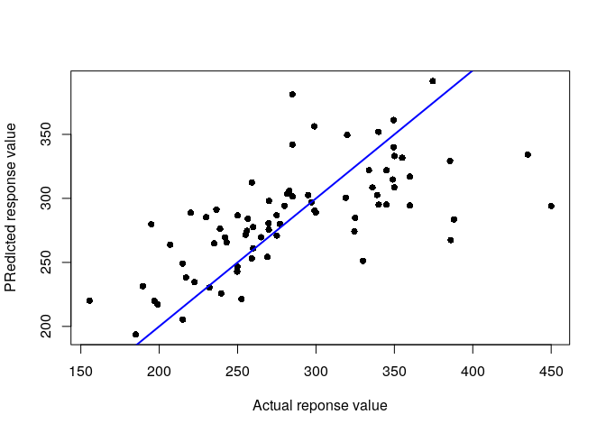<!-- -->

\#Fitting Model and Conducting ANOVA (lm is type 2)

``` r
model = lm(price ~ status + garage + status:garage,
             data = EugeneHomes)
Anova(model, type = 3)
```

    ## Anova Table (Type III tests)
    ## 
    ## Response: price
    ##               Sum Sq Df F value    Pr(>F)    
    ## (Intercept)    59774  1 18.5046 5.246e-05 ***
    ## status           443  1  0.1373    0.7121    
    ## garage          2120  1  0.6562    0.4206    
    ## status:garage     22  1  0.0067    0.9348    
    ## Residuals     232576 72                      
    ## ---
    ## Signif. codes:  0 '***' 0.001 '**' 0.01 '*' 0.05 '.' 0.1 ' ' 1

``` r
summary(model)
```

    ## 
    ## Call:
    ## lm(formula = price ~ status + garage + status:garage, data = EugeneHomes)
    ## 
    ## Residuals:
    ##     Min      1Q  Median      3Q     Max 
    ## -108.50  -38.27  -17.93   38.83  162.28 
    ## 
    ## Coefficients:
    ##               Estimate Std. Error t value Pr(>|t|)    
    ## (Intercept)    264.975     61.598   4.302 5.25e-05 ***
    ## status          -8.231     22.214  -0.371    0.712    
    ## garage          26.765     33.040   0.810    0.421    
    ## status:garage   -1.015     12.359  -0.082    0.935    
    ## ---
    ## Signif. codes:  0 '***' 0.001 '**' 0.01 '*' 0.05 '.' 0.1 ' ' 1
    ## 
    ## Residual standard error: 56.84 on 72 degrees of freedom
    ## Multiple R-squared:  0.1481, Adjusted R-squared:  0.1126 
    ## F-statistic: 4.172 on 3 and 72 DF,  p-value: 0.008815

\#Checking Assumptions

``` r
hist(residuals(model))
```

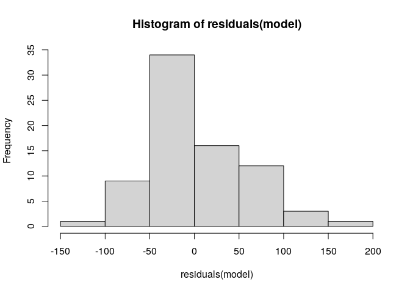<!-- -->

``` r
plot(fitted(model),
     residuals(model))
```

<!-- -->

\#multiple comparisons Bonferroni?

\#Corilation \#First, create a subset without variables to right of
status

``` r
library(dplyr)

EugeneHomes = select(EugeneHomes,
                     price,
                        size,
                        lot,
                        bath,
                        bed,
                        bathbed,
                        year,
                        age,
                        agesq,
                        garage,
                        status)
```

\#to view new subset dataset with the terms specified

``` r
library(FSA)

headtail(EugeneHomes)
```

    ## Warning: headtail is deprecated. Please use the headTail function

    ##   price size lot bath bed bathbed year  age agesq garage status
    ## 1   388 2.18   4    3   4      12 1940   -3     9      0      3
    ## 2   450 2.05   5    3   4      12 1957 -1.3  1.69      2      3
    ## 3   386 2.11   5    2   4       8 1955 -1.5  2.25      2      3
    ## 4   350 1.44   6    1   2       2 1956 -1.4  1.96      1      1
    ## 5   ...  ... ...  ... ...     ...  ...  ...   ...    ...    ...
    ## 6   215 2.04   1  1.1   4     4.4 1936 -3.4 11.56      0      3
    ## 7   435 2.25  11    2   3       6 1979  0.9  0.81      2      3
    ## 8 274.9 1.86   4    2   4       8 1995  2.5  6.25      2      1
    ## 9 349.5  2.9   4    3   5      15 1979  0.9  0.81      2      1

\#to view corrilation

``` r
library(psych)

corr.test(EugeneHomes,
          use = "pairwise", 
          method = "pearson", 
          adjust = "none")
```

    ## Call:corr.test(x = EugeneHomes, use = "pairwise", method = "pearson", 
    ##     adjust = "none")
    ## Correlation matrix 
    ##         price size   lot  bath   bed bathbed  year   age agesq garage status
    ## price    1.00 0.20  0.24  0.17 -0.29   -0.01  0.15  0.15  0.28   0.36  -0.25
    ## size     0.20 1.00  0.04  0.47  0.24    0.47  0.18  0.18  0.01   0.17   0.12
    ## lot      0.24 0.04  1.00 -0.17 -0.21   -0.22 -0.04 -0.04 -0.18   0.24  -0.05
    ## bath     0.17 0.47 -0.17  1.00  0.15    0.79  0.33  0.33 -0.02   0.20  -0.05
    ## bed     -0.29 0.24 -0.21  0.15  1.00    0.71 -0.36 -0.36  0.05  -0.40   0.20
    ## bathbed -0.01 0.47 -0.22  0.79  0.71    1.00 -0.01 -0.01  0.01  -0.11   0.09
    ## year     0.15 0.18 -0.04  0.33 -0.36   -0.01  1.00  1.00 -0.35   0.54  -0.30
    ## age      0.15 0.18 -0.04  0.33 -0.36   -0.01  1.00  1.00 -0.35   0.54  -0.30
    ## agesq    0.28 0.01 -0.18 -0.02  0.05    0.01 -0.35 -0.35  1.00  -0.20   0.15
    ## garage   0.36 0.17  0.24  0.20 -0.40   -0.11  0.54  0.54 -0.20   1.00  -0.33
    ## status  -0.25 0.12 -0.05 -0.05  0.20    0.09 -0.30 -0.30  0.15  -0.33   1.00
    ## Sample Size 
    ## [1] 76
    ## Probability values (Entries above the diagonal are adjusted for multiple tests.) 
    ##         price size  lot bath  bed bathbed year  age agesq garage status
    ## price    0.00 0.08 0.03 0.13 0.01    0.92 0.18 0.18  0.02   0.00   0.03
    ## size     0.08 0.00 0.73 0.00 0.04    0.00 0.13 0.13  0.93   0.13   0.30
    ## lot      0.03 0.73 0.00 0.14 0.06    0.06 0.74 0.74  0.12   0.04   0.65
    ## bath     0.13 0.00 0.14 0.00 0.21    0.00 0.00 0.00  0.86   0.08   0.69
    ## bed      0.01 0.04 0.06 0.21 0.00    0.00 0.00 0.00  0.69   0.00   0.08
    ## bathbed  0.92 0.00 0.06 0.00 0.00    0.00 0.95 0.95  0.94   0.36   0.46
    ## year     0.18 0.13 0.74 0.00 0.00    0.95 0.00 0.00  0.00   0.00   0.01
    ## age      0.18 0.13 0.74 0.00 0.00    0.95 0.00 0.00  0.00   0.00   0.01
    ## agesq    0.02 0.93 0.12 0.86 0.69    0.94 0.00 0.00  0.00   0.08   0.21
    ## garage   0.00 0.13 0.04 0.08 0.00    0.36 0.00 0.00  0.08   0.00   0.00
    ## status   0.03 0.30 0.65 0.69 0.08    0.46 0.01 0.01  0.21   0.00   0.00
    ## 
    ##  To see confidence intervals of the correlations, print with the short=FALSE option

\#to view scatterplot matrix of all variables against each other

``` r
pairs(data=EugeneHomes, ~ price + size + lot + bath + bed + bathbed 
      + year + age + agesq + garage + status)
```

<!-- -->

\#to view correlation with histograms, scatterplots and corrilation
\#numbers

``` r
library(PerformanceAnalytics)

chart.Correlation(EugeneHomes,
                  method="pearson",
                  histogram=TRUE,
                  pch=16)
```

<!-- -->

\#Stepwise procedure to determine the best regression equation

``` r
model.null = lm(price ~ 1, data=EugeneHomes)
model.full = lm(price ~ size + lot + bath + bed + bathbed 
                + year + age + agesq + garage + status, 
                data=EugeneHomes)

step(model.null,
     scope = list(upper=model.full),
     direction="both",
     data=EugeneHomes)
```

    ## Start:  AIC=624.17
    ## price ~ 1
    ## 
    ##           Df Sum of Sq    RSS    AIC
    ## + garage   1     35065 237938 615.73
    ## + bed      1     22361 250641 619.68
    ## + agesq    1     20763 252240 620.16
    ## + status   1     17232 255770 621.22
    ## + lot      1     16284 256718 621.50
    ## + size     1     11078 261925 623.03
    ## + bath     1      8328 264674 623.82
    ## <none>                 273002 624.17
    ## + year     1      6485 266517 624.35
    ## + age      1      6485 266517 624.35
    ## + bathbed  1        35 272967 626.16
    ## 
    ## Step:  AIC=615.73
    ## price ~ garage
    ## 
    ##           Df Sum of Sq    RSS    AIC
    ## + agesq    1     34615 203323 605.78
    ## + lot      1      7374 230563 615.33
    ## + bed      1      6529 231409 615.61
    ## <none>                 237938 615.73
    ## + size     1      5468 232470 615.96
    ## + status   1      5340 232598 616.00
    ## + bath     1      2981 234957 616.77
    ## + year     1       566 237372 617.55
    ## + age      1       566 237372 617.55
    ## + bathbed  1       201 237737 617.66
    ## - garage   1     35065 273002 624.17
    ## 
    ## Step:  AIC=605.78
    ## price ~ garage + agesq
    ## 
    ##           Df Sum of Sq    RSS    AIC
    ## + lot      1     12743 190580 602.86
    ## + status   1      7962 195362 604.74
    ## + bed      1      5384 197939 605.74
    ## <none>                 203323 605.78
    ## + size     1      4269 199054 606.17
    ## + bath     1      2562 200761 606.81
    ## + year     1       954 202369 607.42
    ## + age      1       954 202369 607.42
    ## + bathbed  1       279 203045 607.67
    ## - agesq    1     34615 237938 615.73
    ## - garage   1     48916 252240 620.16
    ## 
    ## Step:  AIC=602.86
    ## price ~ garage + agesq + lot
    ## 
    ##           Df Sum of Sq    RSS    AIC
    ## + status   1      8826 181753 601.26
    ## + bath     1      6169 184411 602.36
    ## <none>                 190580 602.86
    ## + size     1      4174 186406 603.18
    ## + year     1      3819 186761 603.32
    ## + age      1      3819 186761 603.32
    ## + bed      1      3375 187205 603.50
    ## + bathbed  1      1622 188958 604.21
    ## - lot      1     12743 203323 605.78
    ## - garage   1     37268 227848 614.43
    ## - agesq    1     39984 230563 615.33
    ## 
    ## Step:  AIC=601.26
    ## price ~ garage + agesq + lot + status
    ## 
    ##           Df Sum of Sq    RSS    AIC
    ## + size     1      7003 174751 600.27
    ## + bath     1      6635 175118 600.43
    ## <none>                 181753 601.26
    ## + year     1      2524 179229 602.19
    ## + age      1      2524 179229 602.19
    ## + bed      1      2468 179285 602.22
    ## + bathbed  1      2159 179595 602.35
    ## - status   1      8826 190580 602.86
    ## - lot      1     13608 195362 604.74
    ## - garage   1     23621 205374 608.54
    ## - agesq    1     43099 224852 615.43
    ## 
    ## Step:  AIC=600.27
    ## price ~ garage + agesq + lot + status + size
    ## 
    ##           Df Sum of Sq    RSS    AIC
    ## + bed      1      6891 167860 599.21
    ## <none>                 174751 600.27
    ## - size     1      7003 181753 601.26
    ## + bath     1      2278 172473 601.27
    ## + age      1      1437 173313 601.64
    ## + year     1      1437 173313 601.64
    ## + bathbed  1        17 174734 602.26
    ## - status   1     11656 186406 603.18
    ## - lot      1     13632 188383 603.98
    ## - garage   1     17150 191900 605.38
    ## - agesq    1     42002 216753 614.64
    ## 
    ## Step:  AIC=599.21
    ## price ~ garage + agesq + lot + status + size + bed
    ## 
    ##           Df Sum of Sq    RSS    AIC
    ## + bathbed  1      6711 161149 598.11
    ## <none>                 167860 599.21
    ## + bath     1      3027 164833 599.83
    ## - bed      1      6891 174751 600.27
    ## - garage   1      7247 175107 600.42
    ## + year     1       138 167722 601.15
    ## + age      1       138 167722 601.15
    ## - lot      1     10541 178401 601.84
    ## - status   1     11138 178998 602.09
    ## - size     1     11425 179285 602.22
    ## - agesq    1     38931 206791 613.06
    ## 
    ## Step:  AIC=598.11
    ## price ~ garage + agesq + lot + status + size + bed + bathbed
    ## 
    ##           Df Sum of Sq    RSS    AIC
    ## + bath     1      9767 151382 595.36
    ## - size     1      4047 165196 598.00
    ## <none>                 161149 598.11
    ## - garage   1      5138 166287 598.50
    ## - bathbed  1      6711 167860 599.21
    ## + year     1        30 161119 600.10
    ## + age      1        30 161119 600.10
    ## - status   1      9779 170928 600.59
    ## - lot      1     13419 174569 602.19
    ## - bed      1     13585 174734 602.26
    ## - agesq    1     39688 200837 612.84
    ## 
    ## Step:  AIC=595.36
    ## price ~ garage + agesq + lot + status + size + bed + bathbed + 
    ##     bath
    ## 
    ##           Df Sum of Sq    RSS    AIC
    ## <none>                 151382 595.36
    ## - size     1      5745 157127 596.19
    ## - garage   1      6987 158369 596.79
    ## - lot      1      7009 158391 596.80
    ## + year     1       218 151164 597.25
    ## + age      1       218 151164 597.25
    ## - status   1      9239 160621 597.86
    ## - bath     1      9767 161149 598.11
    ## - bathbed  1     13451 164833 599.83
    ## - bed      1     18496 169879 602.12
    ## - agesq    1     39477 190859 610.97

    ## 
    ## Call:
    ## lm(formula = price ~ garage + agesq + lot + status + size + bed + 
    ##     bathbed + bath, data = EugeneHomes)
    ## 
    ## Coefficients:
    ## (Intercept)       garage        agesq          lot       status         size  
    ##     424.245       15.799        2.907        6.516      -13.422       50.164  
    ##         bed      bathbed         bath  
    ##     -88.909       32.010      -96.836

\#Now that we have dropped 2 predictors, we will define the final model
\#this shows coefficients, R-squared, and overall p-value

``` r
model.final = lm(price ~ garage + agesq + lot + status + size
                 + bed + bathbed + bath, data = EugeneHomes)
summary(model.final) 
```

    ## 
    ## Call:
    ## lm(formula = price ~ garage + agesq + lot + status + size + bed + 
    ##     bathbed + bath, data = EugeneHomes)
    ## 
    ## Residuals:
    ##    Min     1Q Median     3Q    Max 
    ## -96.28 -24.06  -6.58  19.75 155.92 
    ## 
    ## Coefficients:
    ##             Estimate Std. Error t value Pr(>|t|)    
    ## (Intercept) 424.2446   116.4120   3.644 0.000524 ***
    ## garage       15.7989     8.9842   1.759 0.083227 .  
    ## agesq         2.9075     0.6956   4.180 8.64e-05 ***
    ## lot           6.5163     3.6997   1.761 0.082752 .  
    ## status      -13.4223     6.6377  -2.022 0.047157 *  
    ## size         50.1643    31.4595   1.595 0.115516    
    ## bed         -88.9093    31.0744  -2.861 0.005625 ** 
    ## bathbed      32.0099    13.1194   2.440 0.017344 *  
    ## bath        -96.8359    46.5757  -2.079 0.041439 *  
    ## ---
    ## Signif. codes:  0 '***' 0.001 '**' 0.01 '*' 0.05 '.' 0.1 ' ' 1
    ## 
    ## Residual standard error: 47.53 on 67 degrees of freedom
    ## Multiple R-squared:  0.4455, Adjusted R-squared:  0.3793 
    ## F-statistic: 6.728 on 8 and 67 DF,  p-value: 1.938e-06

\#We can also do our Analysis of Variance for individual terms

``` r
library(car)

Anova(model.final,
      Type="II")
```

    ## Anova Table (Type II tests)
    ## 
    ## Response: price
    ##           Sum Sq Df F value    Pr(>F)    
    ## garage      6987  1  3.0924  0.083227 .  
    ## agesq      39477  1 17.4720 8.641e-05 ***
    ## lot         7009  1  3.1021  0.082752 .  
    ## status      9239  1  4.0890  0.047157 *  
    ## size        5745  1  2.5426  0.115516    
    ## bed        18496  1  8.1863  0.005625 ** 
    ## bathbed    13451  1  5.9531  0.017344 *  
    ## bath        9767  1  4.3227  0.041439 *  
    ## Residuals 151382 67                      
    ## ---
    ## Signif. codes:  0 '***' 0.001 '**' 0.01 '*' 0.05 '.' 0.1 ' ' 1

\#plot of predicted values with 1-to-1 line

``` r
EugeneHomes$predy = predict(model.final)

plot(predy ~ price,
     data=EugeneHomes,
     pch = 16,
     xlab="Actual reponse value",
     ylab="PRedicted response value")

abline(0,1, col="blue", lwd=2)
```

<!-- -->

\#Histogram of Residuals

``` r
hist(residuals(model.final),col="darkgray")
```

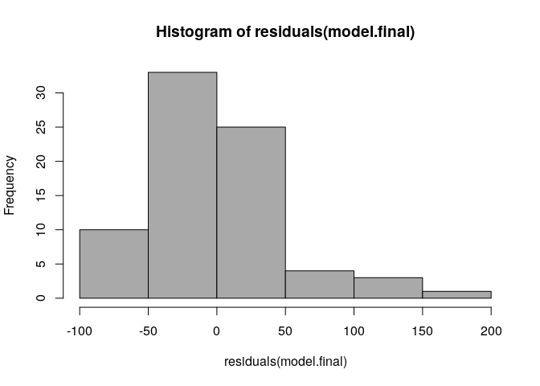<!-- -->

\#plot of Fitted vs. Residuals

``` r
plot(fitted(model.final),
     residuals(model.final))
```

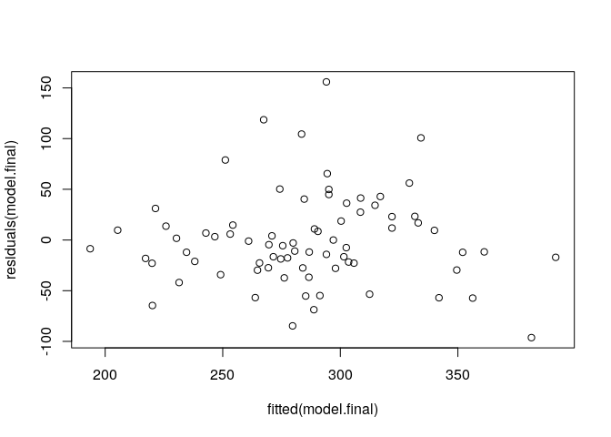<!-- -->
